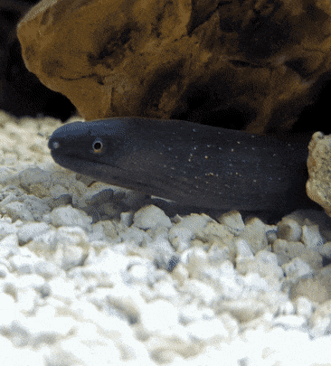

<!-- Banner -->
<!-- Banner font by David Libeau - Hacked -->

  

<!-- One of my snowflake eels -->

<!-- Space between image and text -->

 
I will always be taking steps into learning more about web development, and learning more about myself along the way. I was born in California, but have lived almost all of my entire life in Colorado.
  
The way I see it, any type of programming can be treated as a puzzle, which is why I am drawn to it as an interest; it allows for unique, creative, and many different types of solutions. Video games started off my interest in programming; always wanting to create my own one day and wanting to know exactly how they were made.
  
As time has passed, my programming interests have shifted, and web development is now a large interest of mine. I'm excited to learn more and create something that others will enjoy. Thank you for visiting my GitHub profile!

<!-- https://github.com/DenverCoder1/custom-icon-badges -->
<h2>🗂️ <samp>Highlighted Projects</samp></h2>

<!-- Repo info cards - https://github.com/anuraghazra/github-readme-stats -->

<!-- Socials -->
<!-- Icons from https://simpleicons.org/ -->

<samp>Find me on other platforms:</samp>

<!-- https://github.com/antonkomarev/github-profile-views-counter -->

<!-- Footer / To keep below centered text center -->

<samp>Check out my other repos 👇🏻</samp>

